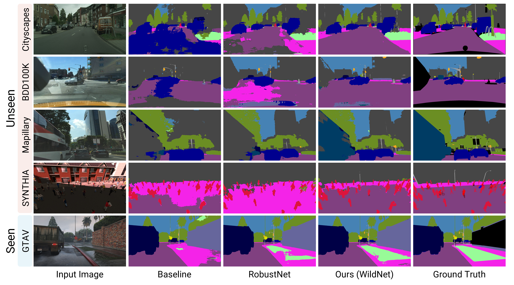

## WildNet (CVPR 2022): Official Project Webpage
This repository provides the official PyTorch implementation of the following paper:
> [**WildNet: Learning Domain Generalized Semantic Segmentation from the Wild**](https://arxiv.org/abs/2204.01446)<br>
> [Suhyeon Lee](https://suhyeonlee.github.io/), [Hongje Seong](https://hongje.github.io/), [Seongwon Lee](https://sungonce.github.io/), [Euntai Kim](https://cilab.yonsei.ac.kr/)<br>
> Yonsei University<br>

> **Abstract:** 
*We present a new domain generalized semantic segmentation network named WildNet, which learns domain-generalized features by leveraging a variety of contents and styles from the wild.
In domain generalization, the low generalization ability for unseen target domains is clearly due to overfitting to the source domain.
To address this problem, previous works have focused on generalizing the domain by removing or diversifying the styles of the source domain.
These alleviated overfitting to the source-style but overlooked overfitting to the source-content.
In this paper, we propose to diversify both the content and style of the source domain with the help of the wild.
Our main idea is for networks to naturally learn domain-generalized semantic information from the wild.
To this end, we diversify styles by augmenting source features to resemble wild styles and enable networks to adapt to a variety of styles. 
Furthermore, we encourage networks to learn class-discriminant features by providing semantic variations borrowed from the wild to source contents in the feature space.
Finally, we regularize networks to capture consistent semantic information even when both the content and style of the source domain are extended to the wild.
Extensive experiments on five different datasets validate the effectiveness of our WildNet, and we significantly outperform state-of-the-art methods.*<br>

<p align="center">
  
</p>

## Pytorch Implementation
Our pytorch implementation is heavily derived from [RobustNet](https://github.com/shachoi/RobustNet) (CVPR 2021). If you use this code in your research, please also cite their work.
[[link to license](https://github.com/shachoi/RobustNet/blob/main/LICENSE)]

### Installation
Clone this repository.
```
git clone https://github.com/suhyeonlee/WildNet.git
cd WildNet
```
Install following packages.
```
conda create --name wildnet python=3.7
conda activate wildnet
conda install pytorch==1.9.1 torchvision==0.10.1 torchaudio==0.9.1 cudatoolkit=11.1 -c pytorch
conda install scipy==1.1.0
conda install tqdm==4.46.0
conda install scikit-image==0.16.2
pip install tensorboardX
pip install thop
pip install kmeans1d
imageio_download_bin freeimage
```
### How to Run WildNet
We trained our model with the source domain ([GTAV](https://download.visinf.tu-darmstadt.de/data/from_games/) or [Cityscapes](https://www.cityscapes-dataset.com/)) and the wild domain ([ImageNet](https://www.image-net.org/)).
Then we evaluated the model on [Cityscapes](https://www.cityscapes-dataset.com/), [BDD-100K](https://bair.berkeley.edu/blog/2018/05/30/bdd/), [Synthia](https://synthia-dataset.net/downloads/) ([SYNTHIA-RAND-CITYSCAPES](http://synthia-dataset.net/download/808/)), [GTAV](https://download.visinf.tu-darmstadt.de/data/from_games/) and [Mapillary Vistas](https://www.mapillary.com/dataset/vistas?pKey=2ix3yvnjy9fwqdzwum3t9g&lat=20&lng=0&z=1.5).

We adopt Class uniform sampling proposed in [this paper](https://openaccess.thecvf.com/content_CVPR_2019/papers/Zhu_Improving_Semantic_Segmentation_via_Video_Propagation_and_Label_Relaxation_CVPR_2019_paper.pdf) to handle class imbalance problems.


1. For Cityscapes dataset, download "leftImg8bit_trainvaltest.zip" and "gtFine_trainvaltest.zip" from https://www.cityscapes-dataset.com/downloads/<br>
Unzip the files and make the directory structures as follows.
```
cityscapes
 └ leftImg8bit_trainvaltest
   └ leftImg8bit
     └ train
     └ val
     └ test
 └ gtFine_trainvaltest
   └ gtFine
     └ train
     └ val
     └ test
```
```
bdd-100k
 └ images
   └ train
   └ val
   └ test
 └ labels
   └ train
   └ val
```
```
mapillary
 └ training
   └ images
   └ labels
 └ validation
   └ images
   └ labels
 └ test
   └ images
   └ labels
```
```
imagenet
 └ data
   └ train
   └ val
```

2. We used [GTAV_Split](https://download.visinf.tu-darmstadt.de/data/from_games/code/read_mapping.zip) to split GTAV dataset into training/validation/test set. Please refer the txt files in [split_data](https://github.com/suhyeonlee/WildNet/tree/main/split_data).

```
GTAV
 └ images
   └ train
     └ folder
   └ valid
     └ folder
   └ test
     └ folder
 └ labels
   └ train
     └ folder
   └ valid
     └ folder
   └ test
     └ folder
```

3. We split [Synthia dataset](http://synthia-dataset.net/download/808/) into train/val set following the [RobustNet](https://github.com/shachoi/RobustNet). Please refer the txt files in [split_data](https://github.com/suhyeonlee/WildNet/tree/main/split_data).

```
synthia
 └ RGB
   └ train
   └ val
 └ GT
   └ COLOR
     └ train
     └ val
   └ LABELS
     └ train
     └ val
```

4. You should modify the path in **"<path_to_wildnet>/config.py"** according to your dataset path.
```
#Cityscapes Dir Location
__C.DATASET.CITYSCAPES_DIR = <YOUR_CITYSCAPES_PATH>
#Mapillary Dataset Dir Location
__C.DATASET.MAPILLARY_DIR = <YOUR_MAPILLARY_PATH>
#GTAV Dataset Dir Location
__C.DATASET.GTAV_DIR = <YOUR_GTAV_PATH>
#BDD-100K Dataset Dir Location
__C.DATASET.BDD_DIR = <YOUR_BDD_PATH>
#Synthia Dataset Dir Location
__C.DATASET.SYNTHIA_DIR = <YOUR_SYNTHIA_PATH>
#ImageNet Dataset Dir Location
__C.DATASET.ImageNet_DIR = <YOUR_ImageNet_PATH>
```

5. You can train WildNet with the following command.
```
<path_to_wildnet>$ CUDA_VISIBLE_DEVICES=0,1 ./scripts/train_wildnet_r50os16_gtav.sh
```

6. You can download our ResNet-50 model at [Google Drive](https://drive.google.com/file/d/1qbIY9EmbDOd0RRclA1ove_U2HaG6ebMj/view?usp=sharing) and validate pretrained model with the following command.
```
<path_to_wildnet>$ CUDA_VISIBLE_DEVICES=0,1 ./scripts/valid_wildnet_r50os16_gtav.sh <weight_file_location>
```

## Citation
If you find this work useful in your research, please cite our paper:
```
@inproceedings{lee2022wildnet,
  title={WildNet: Learning Domain Generalized Semantic Segmentation from the Wild},
  author={Lee, Suhyeon and Seong, Hongje and Lee, Seongwon and Kim, Euntai},
  booktitle={Proceedings of the IEEE/CVF Conference on Computer Vision and Pattern Recognition},
  year={2022}
}
```

## Terms of Use
This software is for non-commercial use only.
The source code is released under the Attribution-NonCommercial-ShareAlike (CC BY-NC-SA) Licence
(see [this](https://creativecommons.org/licenses/by-nc-sa/4.0/legalcode) for details)

